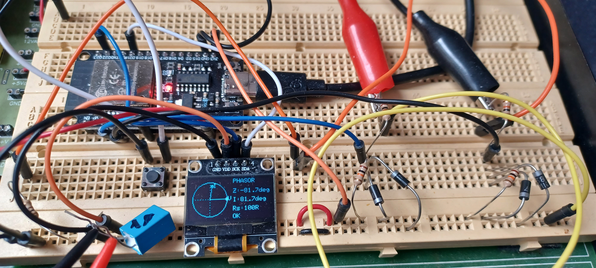
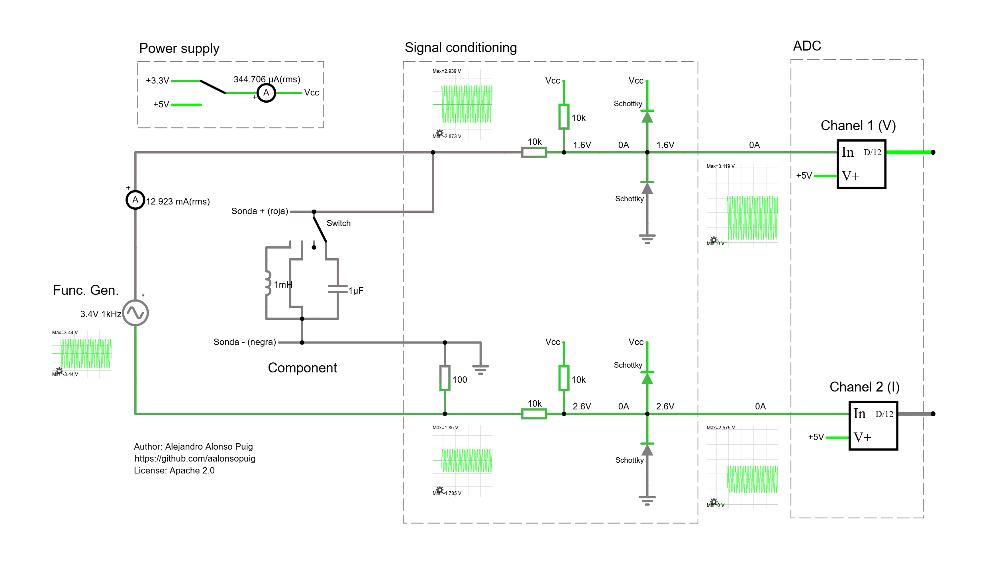

# Phasors analyzer

Educational phasor analyzer proof of concept based on ESP32 and a small SSD1306 OLED display.

The project measures voltage and current waveforms from an external AC excited DUT (Device Under Test) and estimates the phase relationship between them in order to display voltage and current phasors.

The system is intended mainly for:
- educational electronics experiments,
- visualization of reactive behavior,
- basic impedance analysis,
- qualitative phasor demonstrations.

The implementation is intentionally simple and low cost.





## Objective

The main goal of this project is to create a small educational instrument capable of visualizing phasors for:
- resistors,
- capacitors,
- inductors,
- simple passive networks.

The instrument estimates:
- current phase relative to voltage,
- impedance phase angle of the DUT,
- qualitative inductive/capacitive behavior.

The project is not intended to replace professional LCR meters or impedance analyzers.


## Theoretical Foundation

A sinusoidal excitation signal is applied to the DUT using an external floating function generator.

Current is measured indirectly using a sensing resistor connected in series with the DUT.

The system measures:
- voltage across the DUT,
- voltage across the sensing resistor.

Using Ohm's law:

```math
I = V / R
```

the current waveform is estimated.

The software detects the phase difference between voltage and current by analyzing rising zero crossings.

The resulting phase relationship is represented graphically using phasors.

Typical behavior:
- resistor:
  - voltage and current in phase.
- capacitor:
  - current leads voltage.
- inductor:
  - current lags voltage.


## Hardware Implementation

### Main Components

- ESP32 (classic version)
- SSD1306 OLED 128x64 I2C display
- external floating function generator
- analog signal conditioning circuits
- 100 ohm current sensing resistor
- pushbutton for calibration


### OLED Connections

| OLED | ESP32 |
|---|---|
| VCC | 3.3V |
| GND | GND |
| SDA | GPIO21 |
| SCL | GPIO22 |

### Analog Inputs

| Signal | ESP32 Pin |
|---|---|
| DUT voltage | GPIO34 |
| Current sensing resistor voltage | GPIO35 |

### Calibration Button

| Signal | ESP32 Pin |
|---|---|
| Pushbutton | GPIO25 |

The button is connected between GPIO25 and GND using the ESP32 internal pull-up resistor.


## Analog Front-End

The ESP32 ADC only accepts positive voltages in the approximate range:
- 0V to 3.3V

However, the function generator produces bipolar sinewaves.

Therefore, each analog channel uses a passive offset network:
- 10k resistor to signal,
- 10k resistor to 3.3V.

This converts the bipolar input into a shifted signal centered around approximately 1.65V.

Schottky clamp diodes are also used to protect the ESP32 ADC inputs.


[Falstad simulation](https://is.gd/Vh7MvB)


## Software Description

The software performs:

- ADC acquisition,
- offset calibration,
- temporal waveform capture,
- zero crossing detection,
- phase estimation,
- phasor drawing.

The OLED display shows:
- voltage reference phasor,
- current phasor,
- current phase angle,
- impedance phase angle.

The implementation uses:
- interpolated rising zero crossings,
- basic phase offset compensation,
- temporal block acquisition.


## Calibration Procedure

At startup the software performs a guided calibration sequence.

### Step 1: Short probes

The DUT probes are shorted together.

This calibrates the voltage channel offset.

### Step 2: Open probes

The DUT probes are left open.

This calibrates the current channel offset.

### Step 3: Connect calibration resistor

A pure resistive DUT is connected:
- recommended value: 330 ohm.

This measures the systematic instrumental phase error caused by:
- non-simultaneous ADC sampling,
- software timing,
- analog circuitry,
- ADC latency.

The measured phase error is later compensated in software.


## Usage

1. Connect the external floating function generator.
2. Configure a sinewave:
   - approximately 7Vpp,
   - frequencies between 100Hz and 1kHz recommended.
3. Complete the calibration procedure.
4. Connect the DUT.
5. Observe the phasors and phase angle.

Typical recommended DUTs:
- resistors,
- 1uF to 10uF capacitors,
- small inductors,
- transformer windings.


## Limitations

This project is a proof of concept.

Main limitations:
- ESP32 ADC nonlinearity,
- non-simultaneous ADC acquisition,
- low precision at very small currents,
- phase errors at high frequencies,
- limited OLED resolution.

Very small capacitors (for example 10nF) may produce unstable phase measurements at low frequencies because the resulting current is extremely small.

The system is intended mainly for qualitative visualization and experimentation.

